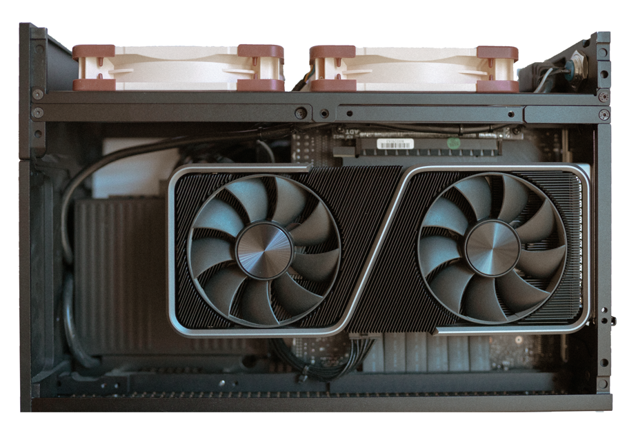

# Setup - August 2024

## Current - 9L SFF PC Build

### Built this build during the COVID Pandemic. - 11/2020
CPU: AMD Ryzen 7 3700X 3.6 GHz 8-Core Processor - Currently Clocked at 4GHz  
CPU Cooler: Noctua NH-L12 Ghost S1 Edition  
Motherboard: Asus ROG Strix X570-I Gaming Mini ITX AM4 Motherboard  
Memory: Corsair Vengeance LPX 32 GB (2 x 16 GB) DDR4-3200 CL16 Memory  
Primary Storage: Western Digital WD_BLACK SN850 1TB NVME  
Secondary Storage: Samsung 970 Evo 500 GB M.2-2280 PCIe 3.0 X4 NVME  
Video Card: NVIDIA Founders Edition GeForce RTX 3070  
Power Supply: Corsair SF750 750W 80+ Platinum Certified  
Case: [Formd T1](https://formdworks.com/collections/t1-1)  
Case Fans: 2x Noctua NF-A12x25 PWM 120mm  

 

